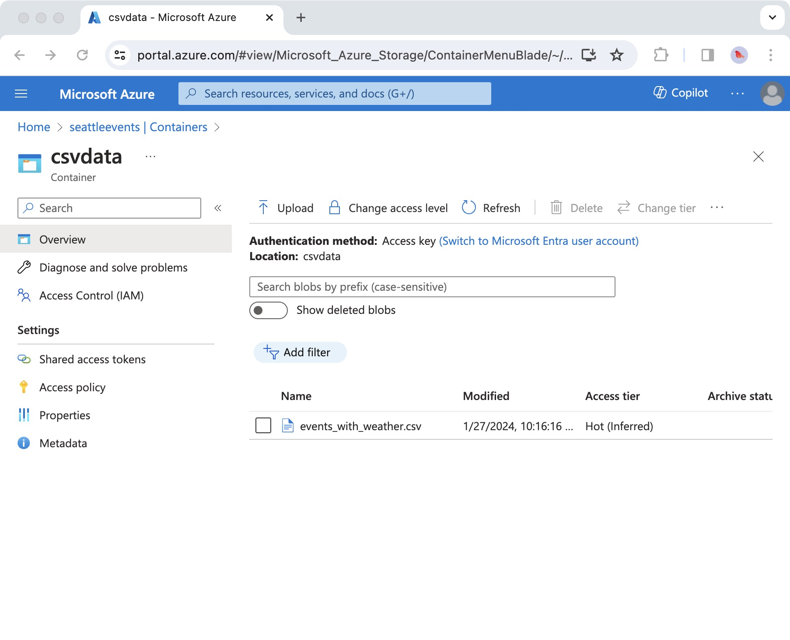

# TECHIN5 10 lab2_Web Scrapers_Wanling

## Overview
This is the assignment about Accessing Web Resources with Python.  
It scrapes and stores seattle's local activities with name, date, location, type, region, latitude and longitude, and daytime weather.  
It is also stored in Azure Blob, and updated at 08:00 UTC every Sunday in Git Actions.

## How to run
Open the terminal and run the following commands:
```bash
pip install -r requirements.txt
```
which incliudes installing ```requests``` and ```beautifulsoup4```

## Lessons learned
- Scrape the list page of Seattle events
- Scrape the Name, Date, Location, Type and Region of Seattle events
- Integrate the Latitude and Longitude info
- Integrate the c info
- Store the data as csv files
- When I want the local csv file to be automatically written and uploaded through workflow, I need to manually change the workflow permissions from "Read repository contents and packages permissions" to "Read and write permissions" in the GitHub Settings. (Path: TECHIN-510-lab2, Settings, Code and automation, Action, General, Workflow permissions)
- The format of inserting image in the README.md: 
```

```

## Future improvements
**My Modifications**  
To save time, I optimized the code to reduces API calls and speeds up the script.

The underlying logic is to simultaneously fill longitude, latitude, as well as weather information for one same locations (Since different activities are held in on same location frequently) in the CSV file, avoiding repetitive API data retrievals. 

To achieve this, the code utilizes two caches: `location_cache` for storing each location's latitude and longitude, and `weather_cache` for weather data of each latitude-longitude pair.

**Bonus:**  
Store the data in Azure Blob Storage as csv:  
- There is a screenshot of Azure Storage showing my success:  

- seattleevents.py is used to upload the CSV file to Blob Storage

Deploy the scraper on GitHub Actions:  
- events_fullinfo.csv and scraper.log are created by scraper.py to ensure that it can run smoothly.  
- .github/workflows folder and corresponding actions.yml filev are created to achieve run the scraper.py periodically (at 08:00 UTC every Sunday).

## Questions
- How to achieve automatic update of csv files stored in Azure Blob Storage like in GitHub Actions?
- How to visualize the data stored in txt format in csv files?